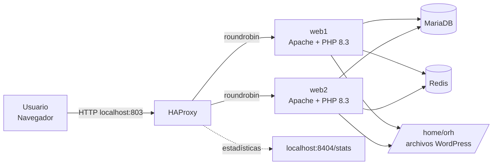
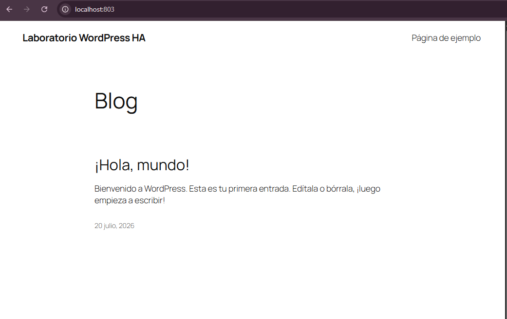
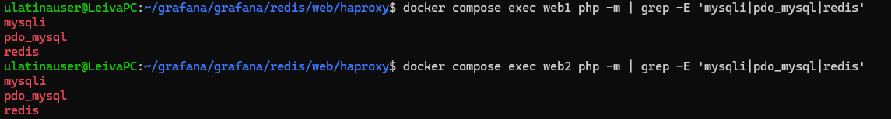
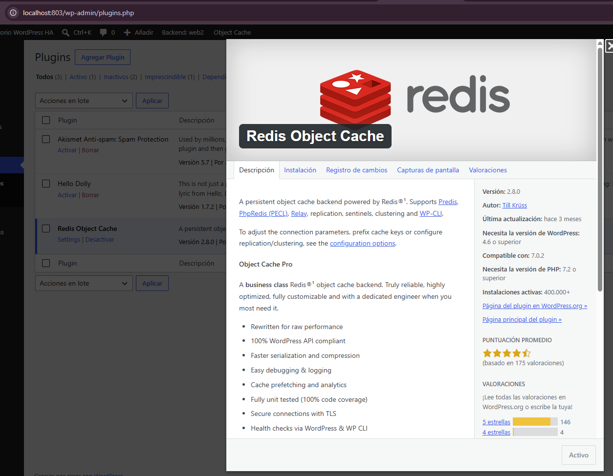
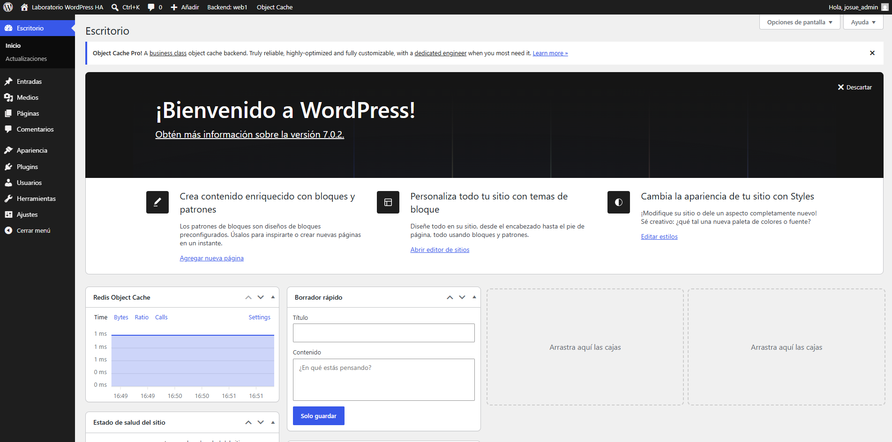
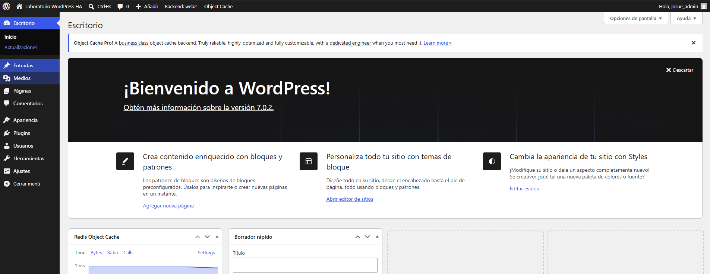
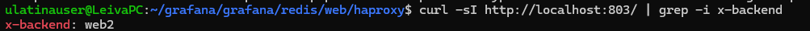
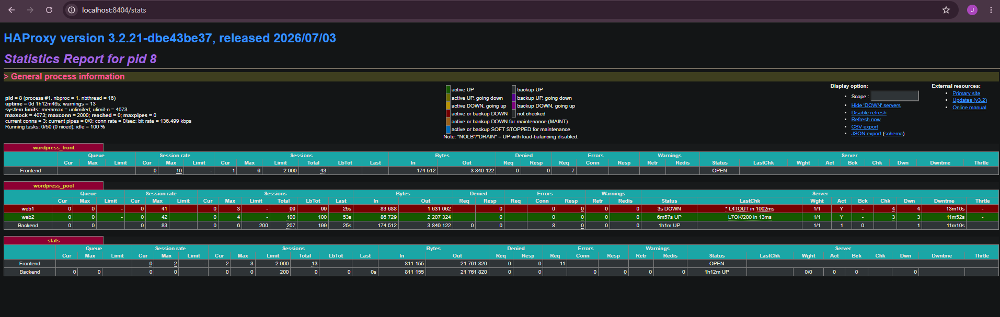
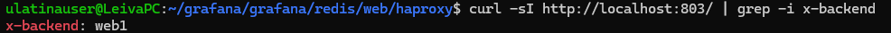
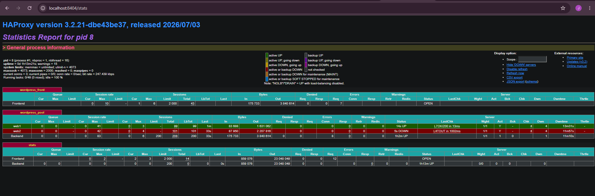

# Laboratorio: WordPress con balanceo de carga, Redis y tolerancia a fallos


**Curso:** Sistemas Operativos Avanzado
**Estudiante:** Josué Leiva Mora
**Plataforma:** Ubuntu 24.04 en WSL, Docker Engine y Docker Compose

---

## 📌 Propósito

Despliegue de un sitio WordPress compuesto por varios contenedores Docker que cooperan dentro de una misma red:

- **MariaDB** — persistencia de datos de WordPress.
- **Redis** — caché de objetos y, opcionalmente, sesiones PHP.
- **web1 / web2** — dos réplicas idénticas de Apache + PHP 8.3.
- **HAProxy** — balanceador de carga (`roundrobin`) con verificación de salud.
- **`/home/orh`** — directorio del host compartido con ambas réplicas web.

El usuario Linux `orh` (UID/GID `1003:1003`) es dueño de todos los archivos del sitio. La imagen web es **genérica**: el UID/GID se inyecta en cada arranque del contenedor mediante variables de entorno, sin necesidad de reconstruir la imagen.

## 🏗️ Arquitectura



## 📂 Estructura del proyecto

```
haproxy/
├── .env
├── compose.yaml
├── haproxy/
│   └── haproxy.cfg
└── web/
    ├── Dockerfile
    ├── docker-entrypoint.sh
    └── redis-session.ini
```

Los archivos de WordPress **no** se versionan en este repositorio; se descargan en `/home/orh` durante el despliegue (ver `.gitignore`).

## 🚀 Despliegue

```bash
# 1. Crear el usuario propietario del sitio (UID/GID 1003:1003)
sudo groupadd -g 1003 orh
sudo useradd -u 1003 -g 1003 -m -s /bin/bash orh

# 2. Construir la imagen genérica y levantar la plataforma
docker compose build --no-cache web1 web2
docker compose up -d

# 3. Descargar WordPress como el usuario orh
sudo -u orh bash -c 'curl -fsSL https://wordpress.org/latest.tar.gz | tar -xz --strip-components=1 -C /home/orh'
```

El sitio queda disponible en `http://localhost:803`. Detalles completos de configuración de Redis, HAProxy y el remapeo dinámico de UID/GID en [`docs/laboratorio.md`](docs/laboratorio.md) *(opcional: copia aquí el enunciado original si quieres conservarlo en el repo)*.

---

## ✅ Evidencias

### 1. Sitio funcionando en `localhost:803`



WordPress respondiendo correctamente a través de HAProxy en la URL pública del laboratorio.

### 2. Estado de los servicios

```
NAME                         IMAGE                  SERVICE   STATUS
wordpress-ha-lab-haproxy-1   haproxy:3.2-alpine     haproxy   Up (running)
wordpress-ha-lab-mariadb-1   mariadb:11.4           mariadb   Up (healthy)
wordpress-ha-lab-redis-1     redis:7.4-alpine       redis     Up (healthy)
wordpress-ha-lab-web1-1      wordpress-ha-php:8.3   web1      Up (healthy)
wordpress-ha-lab-web2-1      wordpress-ha-php:8.3   web2      Up (healthy)
```

### 3. Identidad de `www-data` y extensiones PHP en ambos backends

```bash
$ docker compose exec web1 id www-data
uid=1003(www-data) gid=1003(www-data) groups=1003(www-data)

$ docker compose exec web2 id www-data
uid=1003(www-data) gid=1003(www-data) groups=1003(www-data)
```



Ambos contenedores remapean correctamente `www-data` al UID/GID `1003:1003` (igual que el propietario `orh` del bind mount en el host) y tienen habilitadas las extensiones `mysqli`, `pdo_mysql` y `redis`.

### 4. Propiedad de archivos en `/home/orh`

```bash
$ sudo find /home/orh -maxdepth 4 -printf '%u:%g %m %p\n' | head -50
orh:orh 750 /home/orh
orh:orh 640 /home/orh/wp-activate.php
orh:orh 640 /home/orh/wp-settings.php
orh:orh 640 /home/orh/wp-trackback.php
orh:orh 640 /home/orh/wp-links-opml.php
orh:orh 644 /home/orh/.htaccess
orh:orh 640 /home/orh/wp-config-sample.php
orh:orh 640 /home/orh/wp-login.php
orh:orh 640 /home/orh/wp-comments-post.php
orh:orh 640 /home/orh/wp-blog-header.php
orh:orh 640 /home/orh/wp-signup.php
orh:orh 600 /home/orh/wp-config.php
orh:orh 640 /home/orh/xmlrpc.php
orh:orh 750 /home/orh/wp-content
orh:orh 640 /home/orh/wp-content/object-cache.php
orh:orh 750 /home/orh/wp-content/mu-plugins
orh:orh 640 /home/orh/wp-content/mu-plugins/backend-indicator.php
orh:orh 755 /home/orh/wp-content/upgrade
orh:orh 750 /home/orh/wp-content/plugins
orh:orh 755 /home/orh/wp-content/plugins/redis-cache
orh:orh 750 /home/orh/wp-content/plugins/akismet
...
```

```bash
$ sudo find /home/orh \( ! -uid 1003 -o ! -gid 1003 \) -printf '%u:%g %m %p\n'
$
```

La segunda salida está **vacía**: no existe ningún archivo con UID o GID distinto de `1003`, confirmando que toda la propiedad de `/home/orh` es consistente con el usuario `orh`.

### 5. Balanceo de carga — 10 solicitudes alternadas

```
Solicitud 01: web1
Solicitud 02: web2
Solicitud 03: web1
Solicitud 04: web2
Solicitud 05: web1
Solicitud 06: web2
Solicitud 07: web1
Solicitud 08: web2
Solicitud 09: web1
Solicitud 10: web2
```

`roundrobin` distribuyó las solicitudes en alternancia perfecta 1:1 entre `web1` y `web2`.

### 6. HAProxy — ambos backends `UP`


### 7. Redis Object Cache activo



El plugin **Redis Object Cache** aparece instalado y activo en la lista de plugins, y su widget de métricas (Time / Bytes / Ratio / Calls) se muestra funcionando en tiempo real dentro del escritorio de `wp-admin` (ver evidencia 8).

### 8. Continuidad de la autenticación alternando entre backends

| Backend: web1 | Backend: web2 |
|---|---|
|  |  |

La sesión de `wp-admin` permaneció activa (usuario `josue_admin` autenticado) mientras el indicador de la barra de administración alternaba entre **Backend: web1** y **Backend: web2**, confirmando que ambas réplicas comparten cookie de autenticación, base de datos y `wp-config.php`.

### 9. Fallo de `web1` — `web2` atendiendo

```bash
$ docker compose stop web1
$ curl -sI http://localhost:803/ | grep -i x-backend
X-Backend: web2
```





`web1` quedó marcado como `DOWN` en el panel de estadísticas de HAProxy, mientras `web2` continuó sirviendo todas las solicitudes.

### 10. Fallo de `web2` — `web1` atendiendo

```bash
$ docker compose stop web2
$ curl -sI http://localhost:803/ | grep -i x-backend
X-Backend: web1
```





Prueba simétrica: al detener `web2`, HAProxy lo retiró de la rotación y `web1` asumió la totalidad del tráfico sin interrupción del servicio.

---

## 🧠 Preguntas de análisis

<details>
<summary><b>1. ¿Por qué es relevante que <code>www-data</code> tenga UID 1003 dentro de ambos contenedores?</b></summary>
<br>
Linux evalúa los permisos de archivos mediante identificadores numéricos (UID/GID), no mediante nombres. El propietario real de <code>/home/orh</code> en el host es <code>orh</code>, UID/GID <code>1003:1003</code>. Si los procesos de Apache/PHP no compartieran ese mismo UID numérico, el kernel les negaría permisos de lectura/escritura sobre el bind mount, o los archivos creados quedarían con un propietario distinto al esperado en el host.
</details>

<details>
<summary><b>2. ¿Qué ventaja ofrece ajustar el UID/GID en el entrypoint en lugar de incorporarlo como <code>ARG</code> de construcción?</b></summary>
<br>
Permite reutilizar la misma imagen genérica para sitios con propietarios distintos, cambiando solo variables de entorno y recreando contenedores, sin reconstruir la imagen. Con un <code>ARG</code> de build, cada cambio de propietario obligaría a reconstruir, acoplando la imagen a un sitio específico.
</details>

<details>
<summary><b>3. ¿Qué ocurriría si <code>web1</code> utilizara UID 33 y <code>web2</code> UID 1003?</b></summary>
<br>
Cada backend crearía archivos con un propietario numérico distinto en el mismo bind mount. Uno de los dos backends (o ambos) tendría problemas de permisos para leer/escribir archivos creados por el otro, generando errores intermitentes de "Permission denied" según qué réplica atendiera cada solicitud.
</details>

<details>
<summary><b>4. ¿Por qué Redis Object Cache no es, por sí solo, el responsable de mantener el inicio de sesión nativo de WordPress?</b></summary>
<br>
WordPress Core no depende de <code>$_SESSION</code> ni de una caché de objetos para autenticar; usa una cookie firmada con las claves de <code>wp-config.php</code>, validada contra la base de datos. Redis solo acelera el acceso a datos ya existentes; no participa en la validación del login.
</details>

<details>
<summary><b>5. ¿Qué datos deben ser idénticos o compartidos para que cualquier réplica valide la cookie de autenticación?</b></summary>
<br>
El mismo <code>wp-config.php</code> (claves y salts), la misma base de datos MariaDB, y la misma URL pública (<code>WP_HOME</code>/<code>WP_SITEURL</code>), para que la cookie tenga el mismo dominio y pueda validarse con las mismas claves desde cualquier réplica.
</details>

<details>
<summary><b>6. ¿Qué diferencia existe entre balanceo de carga y alta disponibilidad?</b></summary>
<br>
El balanceo de carga distribuye solicitudes entre servidores para repartir trabajo. La alta disponibilidad busca que el servicio siga operando pese a fallos de cualquier componente, requiriendo redundancia en todas las capas, no solo en la web.
</details>

<details>
<summary><b>7. ¿Por qué esta solución no es completamente tolerante a fallos?</b></summary>
<br>
Porque MariaDB, Redis, HAProxy, el filesystem de <code>/home/orh</code>, Docker Engine y el host WSL siguen siendo puntos únicos de fallo; si cualquiera de ellos cae, el sitio completo deja de funcionar.
</details>

<details>
<summary><b>8. ¿Qué ocurre si falla MariaDB?</b></summary>
<br>
WordPress no puede leer ni escribir ningún contenido. Ambos backends devolverían errores de conexión a la base de datos, dejando el sitio inoperativo aunque web1, web2 y HAProxy sigan funcionando.
</details>

<details>
<summary><b>9. ¿Qué ocurre si falla Redis? Distinga entre caché de objetos y sesiones PHP de plugins.</b></summary>
<br>
Si falla la caché de objetos, WordPress vuelve a consultar directamente MariaDB (más lento, pero funcional). Si fallan las sesiones PHP de plugins, cualquier plugin que use <code>session_start()</code> pierde su estado, pero la autenticación nativa de WordPress no se ve afectada.
</details>

<details>
<summary><b>10. ¿Qué limitación presenta <code>/home/orh</code> si las réplicas se trasladan a hosts distintos?</b></summary>
<br>
Un bind mount es local a la máquina donde corre Docker. En un clúster multi-nodo, cada host tendría su propia copia (o ninguna) de <code>/home/orh</code>, salvo que se use almacenamiento compartido o replicado (NFS, GlusterFS, etc.).
</details>

<details>
<summary><b>11. ¿Qué función cumplen <code>fall 1</code> y <code>rise 2</code> en HAProxy?</b></summary>
<br>
<code>fall 1</code>: basta una comprobación fallida para marcar el servidor como DOWN. <code>rise 2</code>: se necesitan dos comprobaciones exitosas consecutivas para reincorporarlo a la rotación.
</details>

<details>
<summary><b>12. ¿Por qué no se expone MariaDB ni Redis mediante <code>ports</code>?</b></summary>
<br>
Porque solo los backends web los consultan internamente vía la red <code>webnet</code>. Exponerlos ampliaría innecesariamente la superficie de ataque sin beneficio funcional.
</details>

<details>
<summary><b>13. ¿Qué riesgo representa que un usuario pertenezca al grupo <code>docker</code>?</b></summary>
<br>
Tiene acceso al socket de Docker, equivalente en la práctica a privilegios de root: puede montar cualquier directorio del host dentro de un contenedor y leer/modificar cualquier archivo, escalando privilegios sin usar <code>sudo</code> directamente.
</details>

<details>
<summary><b>14. ¿Por qué una solicitud que estaba en ejecución podría fallar aunque exista otra réplica?</b></summary>
<br>
HAProxy no puede migrar a mitad de camino una solicitud ya entregada a un backend. Si ese backend cae durante el procesamiento, la conexión se interrumpe; solo las solicitudes posteriores se enrutan al backend saludable.
</details>

<details>
<summary><b>15. ¿Qué componentes deberían duplicarse para eliminar los puntos únicos de fallo?</b></summary>
<br>
MariaDB (Galera Cluster), Redis (Sentinel/Cluster), el propio HAProxy (IP virtual + keepalived), el almacenamiento (compartido o replicado) y el host/orquestador subyacente (múltiples nodos).
</details>

<details>
<summary><b>16. ¿Cómo cambiaría este laboratorio al implementarlo en Docker Swarm o Kubernetes?</b></summary>
<br>
Los bind mounts locales se reemplazarían por volúmenes compartidos/distribuidos; las réplicas web serían un Deployment/Service con pods en varios nodos; el balanceo lo asumiría el Service/Ingress del orquestador; MariaDB y Redis se externalizarían o desplegarían como StatefulSets con replicación propia; y la configuración/secretos usarían ConfigMaps/Secrets en vez de un <code>.env</code> local.
</details>

---

## 🧾 Conclusiones

- `web1` y `web2` ejecutan la misma imagen genérica; el UID/GID se aplica en tiempo de ejecución, no queda incorporado en la imagen.
- Los archivos creados desde WordPress pertenecen consistentemente a `orh:orh` (`1003:1003`).
- MariaDB mantiene el estado persistente principal; Redis provee una caché de objetos común verificada como conectada desde ambos backends.
- HAProxy distribuye solicitudes sin afinidad de backend (`roundrobin`); un usuario autenticado es atendido indistintamente por cualquiera de las réplicas.
- Al detener una réplica, HAProxy la retira de la rotación y la autenticación no se pierde.
- La arquitectura **no** es alta disponibilidad integral: MariaDB, Redis, HAProxy y el host siguen siendo puntos únicos de fallo.

---

## 📚 Referencias

- [Docker Compose file reference: Services](https://docs.docker.com/reference/compose-file/services/)
- [HAProxy — Backends and roundrobin load balancing](https://www.haproxy.com/documentation/haproxy-configuration-tutorials/proxying-essentials/configuration-basics/backends/)
- [HAProxy — Health checks](https://www.haproxy.com/documentation/haproxy-configuration-tutorials/reliability/health-checks/)
- [WordPress.org — Redis Object Cache](https://wordpress.org/plugins/redis-cache/)
